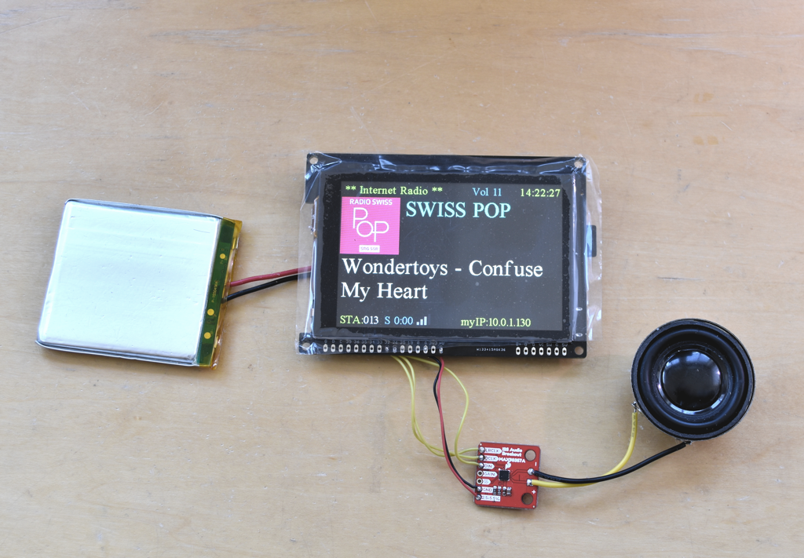
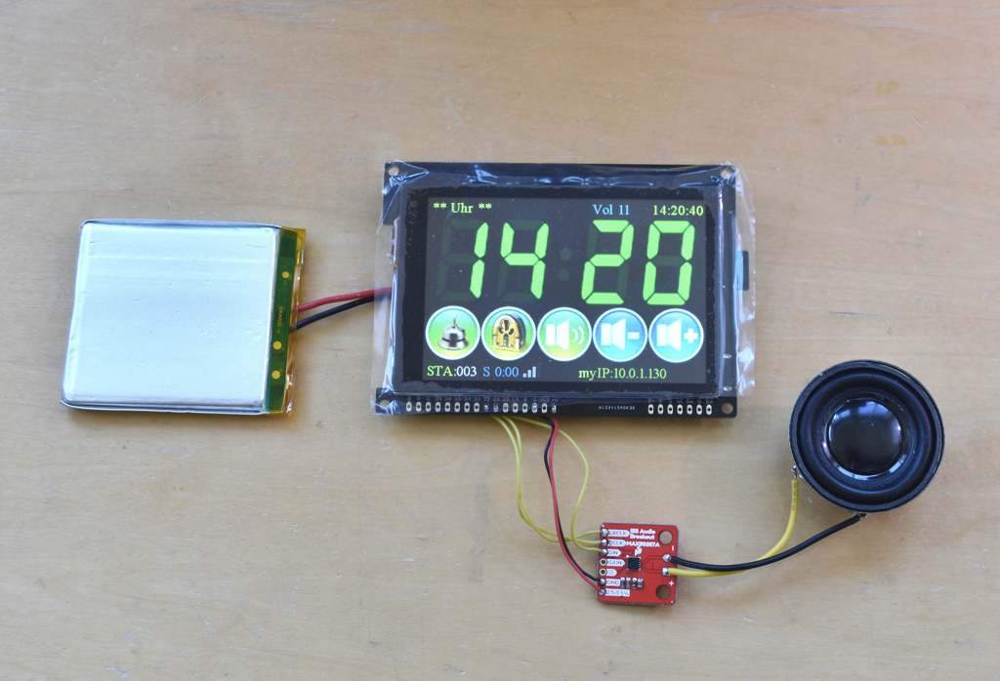
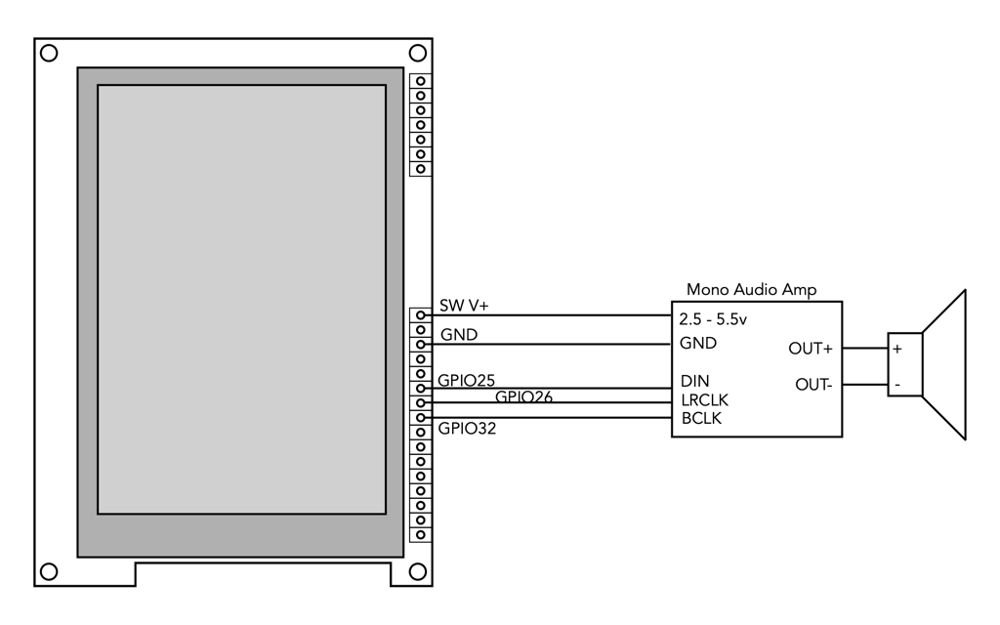

# ESP32-MiniWebRadio V2 ported to gCore



This is a port of schreibfaul1's MiniWebRadio V2 ported to gCore.  It's quite a fun program.  My changes include

1. Support for capacitive touch I2C-based FT6236 touchscreen controller
2. Support for 80 MHz VSPI interface to LCD
3. gCore battery backed RTC used to provide time if a Wifi is not connected or the NTP time cannot be received (timezone set to my MST timezone)
4. LCD Brightness control changed from PWM output to gCore brightness control
5. SD_MMC changed to use 4-bit interface
6. gCore power button can be used to stop audio playback (short press) or power down (long press)
7. Made support for the IR remote even more optional as conditionally compiled code



I used the [Sparkfun MAX98357A I2S Breakout](https://www.sparkfun.com/products/14809) and a cheap speaker I had laying around.  Connections shown below.  I used PlatformIO for coding and builds as schreibfaul1 recommends (see his instructions for PlatformIO installation and building the project).



You have to edit the ```src/common.h``` file to setup your Wifi SSID and password.  As schreibfaul1 explains you also have to unpack the ```Content_on_SD_card.zip``` to a Micro-SD card and plug that into gCore.  You can customize a lot by changing the files on the Micro-SD card including the list of internet radio stations.

Files I changed include ```src/common.h```, ```src/main.cpp```,  ```lib/tftLib/tft.h``` and```lib/tftLib/tft.cpp```.  I also added the ```lib/gCore``` library.

## schreibfaul1's original readme
Features:
<ul>
<li>Can handle max 999 stations</li>
<li>IR remote control is optional</li>
<li>Obtains time from NTP</li>
<li>Can used as alarmclock, has sleeptimer</li>
<li>Speech the time every hour in radiomode</li>
<li>If the display has a Backlight-pin You can change the brightness</li>
<li>supports the Latin, Greek and Cyrillic character sets</li>
<li><a href="https://www.radio-browser.info/">Community Radio Browser</a> is integrated as a search engine</li>
<li>Channel lists can be exported or imported in Excel format (for data backup).</li>
</ul><br>
Required HW:
<ul>
<li>Decoder module VS1053 or external DAC (e.g. PCM5102a)</li>
<li>TFT Display with Tochpad (SPI), Controller can be ILI9341 (320x240px), HX8347D (320x240px), ILI9486 (480x320px) or ILI9488 (480x320px)</li>
<li>ESP32 Board (PSRAM not necessary)</li>
<li>SD Card + adapter</li>
</ul><br>

Control is exclusively via the touchscreen or the webpage, no additional components such as switches, rotary encoders, capacitors or resistors are required

<a href="https://github.com/schreibfaul1/ESP32-MiniWebRadio/blob/MiniWebRadio-V2/additional_info/MWR_V2_VS1053.jpg">Schematic with VS1053</a><br>
<a href="https://github.com/schreibfaul1/ESP32-MiniWebRadio/blob/MiniWebRadio-V2/additional_info/MWR_V2_DAC.jpg">Schematic with external DAC</a><br>
<br>
<a href="https://github.com/schreibfaul1/ESP32-MiniWebRadio/blob/MiniWebRadio-V2/additional_info/MiniWebRadio%20V2%20Layout.pdf">Display (Layout)</a>

<a href="https://github.com/schreibfaul1/ESP32-MiniWebRadio/blob/MiniWebRadio-V2/additional_info/How%20to%20install.pdf">How to install:</a>
PlatformIO is definitely recommended as an IDE

New in V2:
<ul>
<li>The audioprocess works in his own task amd must therefore be decoupled. If a VS1053 is used, it must have its own SPI bus (HSPI for VS1053 and VSPI for TFT and TP). Dropouts when drawing on the display or when the website is loading are a things of the past. </li>
<li>The SD card is wired as SD_MMC to improve stability and increase speed. This means that the GPIOs cannot be chosen freely. The <a href="https://github.com/schreibfaul1/ESP32-MiniWebRadio/blob/MiniWebRadio-V2/additional_info/SD_Card_Adapter_for_SD_MMC_.jpg">SD card adapter</a> must not have any resistors as pull-ups or in series.</li>
<li>Instead of the VS1053, it can be decoded using SW. Possible formats are mp3, aac, mp4 and flac (flac requires PSRAM). A DAC is required (e.g. UDA13348, MAX98357A, PCM5102A) connected via I2S.</li>
<li>The display can now be 480x320px, the ILI9486 (SPI display from the Raspberry PI) is supported</li>
<li>In the finished device, the SD card may be inaccessible. For this case, an FTP server is integrated. Here are the settings in <a href="https://github.com/schreibfaul1/ESP32-MiniWebRadio/blob/MiniWebRadio-V2/additional_info/Filezilla.pdf">Filezilla</a>. The username and password are 'esp32' and can be changed in 'common.h'</li>
<li>supports AC101 and ES8388</li>
<li>WM8978 support (TTGO audioT board)</li>
<li>Entry of username and password if the server expects access data, "URL|user|pwd"</li>
<li>Can process local playlists in m3u format</li>
<li>The ESP32 or the ESP32-S3 can be used</li>
<br>
<br>
 


